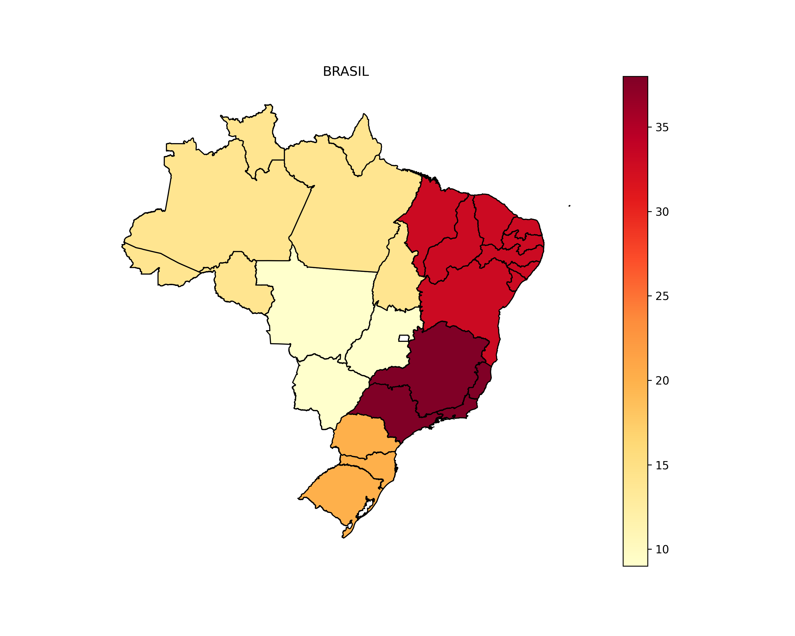
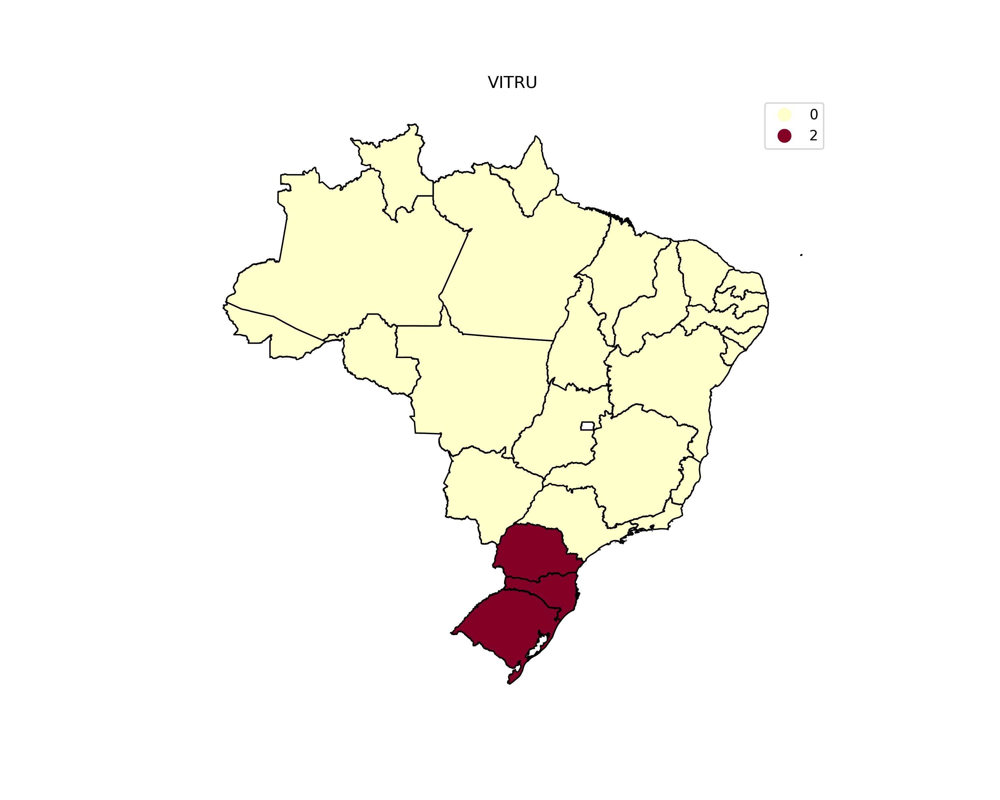

# Rosilda - Mapas de calor

## Instalação e execução

Para instalar e executar o projeto, siga os passos abaixo:

```bash
pip install -r requirements.txt

python geral.py

python empresas.py
```

## Introdução

Este projeto tem como objetivo a criação de mapas de calor para o Brasil, utilizando a linguagem de programação Python, para a minha amiga Rosilda. Foram utilizados dados do número de instituições de ensino superior por região do Brasil pertencentes aos grupos Ânima, Cogna, Cruzeiro do Sul, Ser Educacional, Vitru e Yduqs em 2024.

## Mapas

Brasil:



Ânima:


Cruzeiro do Sul:


Ser Educacional:


Vitru:



Yduqs:


